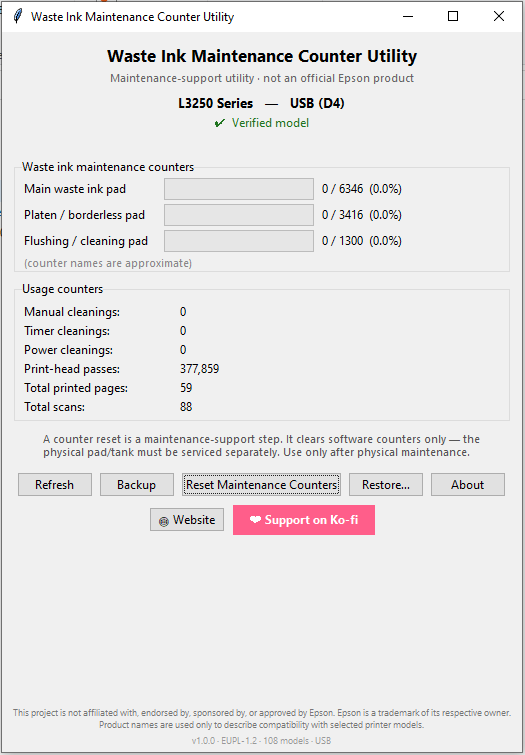

# Waste Ink Maintenance Counter Utility



Version 1.0.0 — Open-source, maintenance-focused, EUPL-1.2 licensed.

Executable: `MaintenanceCounterUtility.exe`
Platform: Windows 64-bit, USB connection only.

## Download & install

1. Download the latest release: **https://github.com/devmosman/MaintenanceCounterUtility/releases/latest**
2. Unzip and run `MaintenanceCounterUtility.exe` (no installation needed).
3. On first run, read and accept the Terms of Use.
4. Connect the printer by **USB cable**, power it on, then use the app.

**Unsigned binary note:** the `.exe` is not code-signed, so Windows SmartScreen may show *"Windows protected your PC"* → click **More info → Run anyway**. Some antivirus tools flag PyInstaller `.exe` files as a false positive.

**Verify your download (recommended):** each release includes `SHA256SUMS.txt`. Check the file's hash with PowerShell:
```
Get-FileHash .\MaintenanceCounterUtility.exe -Algorithm SHA256
```
and compare it to the value in `SHA256SUMS.txt`. You can also build it yourself from source (see the build instructions below) — the full source is published with every release under EUPL-1.2.

**Full step-by-step usage:** see the **[User Guide](USER_GUIDE.md)**.

## (A) What this project is

The **Waste Ink Maintenance Counter Utility** is an open-source, maintenance-focused utility for selected **compatible** inkjet printers. It reads the approximate waste-ink maintenance counters that some printers expose, creates a local backup of the relevant data, and can reset those counters **only after** the printer owner has physically inspected, cleaned, replaced, or redirected (via an external tank) the waste-ink pad/tank.

This tool performs **no physical maintenance** and is **not** a way to avoid service requirements. It is a software aid for owners who have already carried out the necessary physical service on their own hardware.

It runs with **no runtime dependencies** beyond the Python standard library and `ctypes`. The only build dependency is PyInstaller.

## (B) Non-affiliation notice

> This project is not affiliated with, endorsed by, sponsored by, or approved by Epson. Epson is a trademark of its respective owner. Product names are used only to describe compatibility with selected printer models.

## (C) Supported models

The embedded model database contains **108 compatible models**.

- **Verified (hardware, June 2026):** `L3250`, `L3251`, `L3253`, `L3255`. These were verified on real hardware by this project.
- **Experimental (EUPL-derived):** all other models. This data is derived from `epson_print_conf` (EUPL-1.2, Copyright (c) 2024-2025 Ircama) and has **not** been verified on hardware by this project. Treat experimental entries with extra caution.

There is no unlicensed, proprietary, vendor, or reverse-engineered vendor database in this project.

For the complete list and the full data provenance, see:

- [`SUPPORTED_MODELS.md`](SUPPORTED_MODELS.md) — full model list and verification status.
- [`DATA_PROVENANCE.md`](DATA_PROVENANCE.md) — where the data came from and how it was licensed.

## (D) What the tool does

- Reads the **approximate** waste-ink maintenance counters where the model supports it.
- Creates a **local backup** of the relevant EEPROM data where supported, taken automatically **before** every reset.
- Can **reset** the maintenance counters **after** the owner has performed the required physical maintenance.

All values are approximate. Counter readings depend on model support and may differ from the printer's internal accounting.

## (E) What the tool does NOT do

- It does **not** clean, replace, or service the waste-ink pad.
- It does **not** empty or maintain an external waste-ink tank.
- It does **not** repair any hardware or perform any physical maintenance.
- It does **not** guarantee compatibility with any printer, especially Experimental models.
- It does **not** override or remove the need for physical maintenance.
- It does **not** provide legal advice.
- It is **not** an official Epson product and is not affiliated with or endorsed by Epson.

## (F) Physical maintenance warning

Waste-ink maintenance counters exist to track ink absorbed by the waste-ink pad/tank. Resetting these counters **without** performing the corresponding physical maintenance may cause **ink leakage, overflow, staining, or damage** to the printer and surrounding surfaces.

Before resetting, you must have physically inspected, cleaned, replaced, or redirected (via a functioning external tank) the waste-ink pad/tank. The reset only updates a counter — it does not absorb or remove any ink.

The application enforces several safeguards to keep this maintenance-focused:

- A first-run Terms-of-Use acceptance.
- A mandatory pre-reset warning with 8 points.
- A required checkbox: *"I confirm that the waste ink pad has been inspected, cleaned, replaced, or an external waste ink tank is installed and functioning."*
- A required second confirmation: *"I understand this action modifies printer maintenance counters and I accept full responsibility for ensuring physical maintenance has been completed."*
- An automatic EEPROM backup taken **before** every reset. The reset **stops** if the backup fails, unless the user explicitly overrides with a warning.
- Restore-from-backup support.
- Local operation logs recording model, transport, counter values, backup path, confirmation flags, and errors — but **not** serial numbers or personal data.
- A low-counter caution and a reminder to power-cycle the printer after a reset.

There is **no telemetry**; nothing is transmitted off the device.

## (G) Legal caution

This is **not legal advice**.

Anti-circumvention, repair, warranty, consumer-protection, product-liability, and trademark laws **vary by jurisdiction**. This project makes **no claim of legal clearance** and provides no warranty that any particular use is lawful in your location.

If you intend to distribute this software for payment, it **requires legal review before paid distribution** by a qualified local IP/product lawyer. This project is offered as a risk-reduced, compliance-oriented, maintenance-focused tool, but only a qualified lawyer in your jurisdiction can advise on your specific situation.

## (H) Build instructions

```sh
# Create a virtual environment
python -m venv .venv

# Activate (Windows)
.venv\Scripts\activate

# Install the build tool
pip install pyinstaller

# Run the app from source
python maintenance_counter_app.py

# Run the tests
python -m unittest discover -s tests -v

# Build the binary
pyinstaller --onefile --windowed --clean --noconfirm --name MaintenanceCounterUtility --hidden-import epson_d4 --hidden-import model_db --hidden-import printer_core --hidden-import eeprom_io --hidden-import operations --hidden-import oplog maintenance_counter_app.py
```

The only build dependency is PyInstaller. There are no runtime dependencies beyond the Python standard library and `ctypes`.

## (I) Usage steps

1. **Select and connect** your printer over USB (Windows 64-bit, USB connection only).
2. **Read** the approximate waste-ink maintenance counters where supported.
3. **Review** the reported values and the verification status of your model (Verified vs Experimental).
4. **Create a backup** — an automatic EEPROM backup is taken before every reset; the reset stops if the backup fails unless you explicitly override.
5. **Physically service** the waste-ink pad/tank: inspect, clean, replace, or install/verify a functioning external waste-ink tank.
6. **Confirm the acknowledgement** checkbox and complete the **second confirmation** after reviewing the mandatory pre-reset warning.
7. **Reset** the maintenance counters.
8. **Power-cycle** the printer when prompted.
9. Review the **local operation logs** if you need a record of what was done (model, transport, counter values, backup path, confirmation flags, errors — no serial numbers or personal data).

If anything looks wrong, you can **restore from backup**.

## (J) Adding new models

Contributions of new compatible models are welcome, provided the data has clear, compatible provenance.

- See [`CONTRIBUTING.md`](CONTRIBUTING.md) for how to propose changes and add models.
- See [`DATA_PROVENANCE.md`](DATA_PROVENANCE.md) for the required provenance and licensing for any model data.

Do not add unlicensed, proprietary, vendor, or reverse-engineered vendor data.

## (K) License

This project is licensed under the **EUPL-1.2**. See [`LICENSE.txt`](LICENSE.txt).

The EUPL-1.2 is a copyleft license: the **corresponding source code must be published with any binary release**. If you distribute `MaintenanceCounterUtility.exe`, you must also make the matching source available under the same terms.
